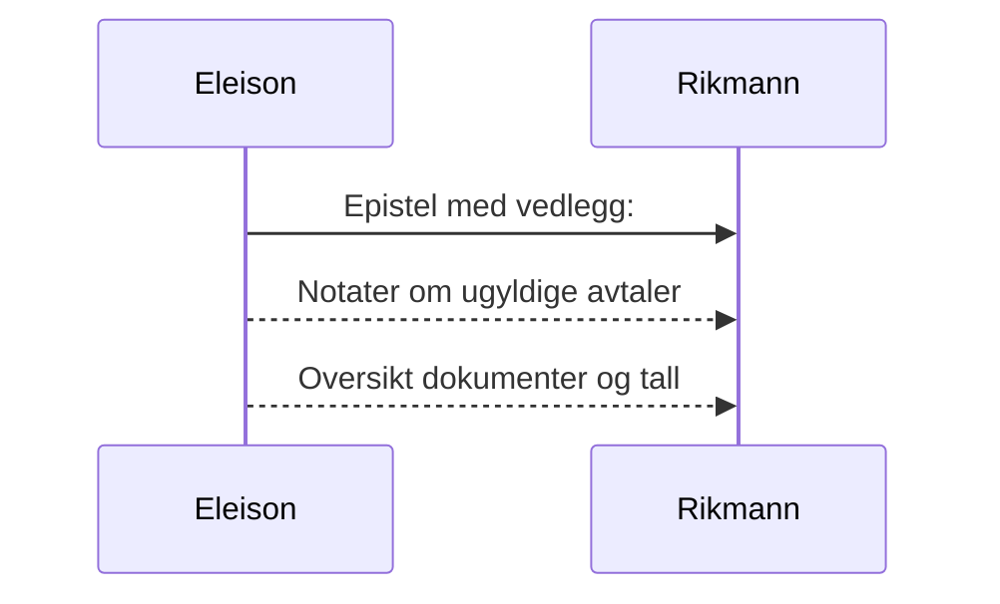

# Eleison til den rike mann
_Dersom du bærer fram et offer til alteret og der kommer til å tenke på at en annen har noe å anklage deg for, så la offergaven ligge foran alteret og gå først og bli forlikt med ham. Kom så og bær fram ditt offer! Skynd deg å komme overens med din motpart mens du ennå er med ham på veien._ Matt 5, 24.

Kjære rike mann! _ Ingen tjener kan tjene to herrer; for han vil enten hate den ene og elske den andre, eller holde sig til den ene og forakte den andre; I kan ikke tjene Gud og mammon._ (Luk 16, 13) Du er i ferd med å bedra dine søsken og svindle dem for største delen av arven som dere alle burde dele likt. Måten du har gjort det på kan kanskje skjules for de som ikke har forstand på lov og rett. Men Gud være takk som har gitt meg visdom og forstand på lov og rett, og til å skille mellom rett og galt.

Det er et grunnleggende prinsipp i kristendommen:
* Den som ikke vil dømmes av loven som en synder har heller ingen behov for å be om tilgivelse.[^1]

## Faktum og drøfting av sak(er)
### Salg av leilighet[^2]
Det som åpenbares er at du forsøker å gjøre deg rik på bekostning av din syke søster og dine andre søsken, hvilket du svindlet for en halv million kroner (fra to av dem), og som ingen av dem har klaget over hittil.

Nå tar Eleison til ordet på vegne av dine søsken, og gjør oppmerksom på at du overtalte/ manipulerte din syke søster til å godta å selge leiligheten for mindre enn det hun gav for den (flere år i forveien). Da hun solgte den til deg hadde du innhentet en takst som viste at den var verdt `485 000` kroner mer. Denne taksten underslo du, og holdt skjult for din syke søster.

Det er kjent at du har vært din syke søsters økonomiske verge, og hvis du på salgs- tidspunktet har vært hennes verge, er dette svært alvorlig misbruk av tillitsforhold.

### Konkret ad et privat lån - som bedrageriet er knyttet til
Da din syke søster ble tvunget til å selge begynte din eldste søster å hjelpe din mor (som før hun døde ble kastet ut av en bolig du eide som hun hadde bodd i de siste 20 årene). Din eldste søster hadde ordnet en avtale med kommunen om at din mor kunne få 100% finanisering.

Faktum er at du da grep inn og ikke lot din mor få låne mer enn ca. 50% av banken. Resten ble hun manipulert til å låne privat hos deg. For å få innvilge dette avdragsfrie private lånet, måtte hun gå med på å skrive under på at du skulle få betalt `744 620` kroner for å pusse litt opp (med ny parkett og maling på veggene i stua).

Dette lånet er notifisert i et gjeldsbrev som nærmere bestemt består av to deler. 

Vel halvparten av gjeldsbrevet er et beløp som din mor faktisk og reelt trengte (i tillegg til banklånet) for å overta leiligheten til hennes syke datter.

Din mor var sannynligvis svekket av demens på slutten og hun har også vært svært fortvilt og hjelpetrengende da hun slet med å finne annen ledig leilighet. (Det er forståelig at du hadde et økonomisk motiv for å kaste henne ut, da kommunen kunne tilby deg 1/3 mer i husleie for å leie ut til flyktninger fra Ukraina.) 

**Det er svært urimelig (og uredelig) at du nå ved å gjøre gjeldsbrevet gjeldende krever at du og ditt hus skal ha over 700 000 kroner for minimal oppussing av den leiligheten som du nå har arvet en andel av.**[^3] Din mor har sannsynligvis ikke forstått at du ved denne avtalen stjal tre kvart million kroner fra hennes andre barn som hun helt sikkert ikke ville gjort noe slikt mot - hvis hun hadde forstått innholdet i gjeldsbrevet.

Enten må du fremlegge dokumenter som beviser at del 2 i gjeldsbrevet som beløper seg til ca. 744 620 kroner er rettmessig, eller frafalle det meste av kravet.

### Mot ærbarhet
Det presiseres at det også vil stride mot ærbarhet og gjøre mer enn 10% av gjeldsbrevets del 2 gyldig, og at det i så fall vil dreie seg om urimelig pris for tjenester og varer.

### Summa
> Inntil det motsatte er bevist hevdes det at vel 94% av gjeldsbrevets del 2 (744 620 x 0.94) er ugyldig (ca. 700 000,-). Se vedlegg 2 for utregning.

### Prosessen videre
Dersom ikke kravet i del 2 av gjeldsbrevet for det meste frafalles, vil trolig virkningen av det være en prosess hvor rettmessigheten av ditt krav vil prøves av ulike kontrollinstanser. Det er forhåpentligvis dommere som skal prøve gyldigheten av gjeldsbrevet, både innholdsmangler og eventuelle mangler ved din mor (demens).

### Bønn til den rike mann
Det er i kristelig kjærlighet dette skrives til deg. Du får nå mulighet til å omvende deg og avstå fra å fortsette med å la grådigheten styre deg. 

```
Vennlig hilsen

Eleison
Jurist
```

Vedlegg: 
1. [Notater om ugyldige avtaler](/article/griskhet/vedlegg-notater-om-ugyldige-avtaler){:target="_blank"}
2. [Oversikt dokumenter og tall](/article/griskhet/vedlegg-dokumenter-og-tall){:target="_blank"}



[^1]: Men dersom vi dømte oss selv, blev vi ikke dømt; men når vi dømmes, da refses vi av Herren, forat vi ikke skal fordømmes sammen med verden. (1 Kor 11, 31-32) Jfr. [Sal 32, 5](https://no.bibelsite.com/psalms/32-5.htm){:target="_blank"} og [Hebr 12, 5-6](https://no.bibelsite.com/hebrews/12-5.htm){:target="_blank"}.
[^2]: Årsaken til at denne saken nevnes er kun for å vise hvor alvorlig dypt den rike mann er falt i mørket. Saken kan overses og utelates i første omgang, slik at man kan konsentrere seg om det mest alvorlige - nemlig bedrageriet som gjeldsbrevet i realiteten er.
[^3]: Det er sannsynlig at dine nærmeste i ditt hus er medvirkende i bedrageriet som nå forsøkes å realiseres.