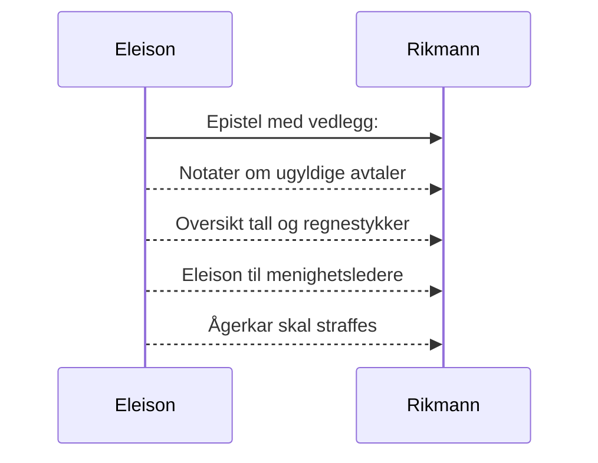

# Eleison til den rike mann
_Dersom du bærer fram et offer til alteret og der kommer til å tenke på at en annen har noe å anklage deg for, så la offergaven ligge foran alteret og gå først og bli forlikt med ham. Kom så og bær fram ditt offer! Skynd deg å komme overens med din motpart mens du ennå er med ham på veien._ [Matt 5, 23-24](https://no.bibelsite.com/matthew/5-23.htm){:target="_blank"}.

Kjære rike mann! 

_Ingen tjener kan tjene to herrer; for han vil enten hate den ene og elske den andre, eller holde sig til den ene og forakte den andre; I kan ikke tjene Gud og mammon._ [Luk 16, 13](https://no.bibelsite.com/luke/16-13.htm){:target="_blank"}

Du er i ferd med å bedra dine søsken og svindle dem for største delen av arven som dere alle burde dele likt.[^1] Måten du har gjort det på kan kanskje skjules for de som ikke har forstand på lov og rett. Men Gud være takk som har gitt sin tjener visdom og forstand på lov og rett, og til å skille mellom rett og galt.[^2]

Derfor har Gud ledet Eleison til å anvende loven på deg, for om mulig å føre deg til Kristus. Viser til det grunnleggende prinsipp om at vi må bli knust av loven og innrømme vår synd før vi kan bli tatt til nåde av Gud.[^3]

## Faktum og drøfting av sak
### Konkret ad et privat lån - som bedrageriet er knyttet til
Før din syke søster ble tvunget til å selge begynte en av dine andre søsken å hjelpe din mor med å finne et sted å bo.[^4] Denne hjelperen var i ferd med å inngå en avtale med kommunen om at din mor kunne få 100% finanisering til å kjøpe hennes syke datters leilighet som måtte selges.

Faktum er at du da grep inn (og forlikte deg med din mor) og overtalte henne til å låne halvparten av kjøpesummen privat hos deg. For å få innvilget dette avdragsfrie private lånet, skrev hun under på et gjeldsbrev, som hun naturligvis har trodd bestod av et beløp som hun faktisk og reelt ville motta i virkeligheten. 

Dette lånet (er som nevnt notifisert i et gjeldsbrev) som etter nærmere granskning består av en reell del og en proforma ikke reell del. Begge omtrent like store, hvor den faktiske reelle delen beløper seg til `755 380,-` mens proforma ikke reell del beløper seg til `744 620,-`. Totalt lyder gjeldsbrevet på kr. `1 500 000,-`

Vel halvparten av gjeldsbrevet `755 380,-` er et beløp som din mor faktisk og reelt trengte (i tillegg til banklånet) for å kjøpe leiligheten fra hennes syke datter.

### Drøfting av sak
::TipBox{type="announce" name="Uredelig"}
Det er svært urimelig (og uredelig) at du nå ved å gjøre gjeldsbrevet gjeldende krever at du og ditt hus skal inndrive en ikke-reell proforma andel på over `700 000 kroner`.[^5] 

Din mor har sannsynligvis ikke forstått at du ved denne avtalen tok tre kvart million kroner fra hennes andre barn, som hun selvfølgelig ikke ville gjort hvis hun hadde forstått innholdet i gjeldsbrevet. Viser til at hun var svært hjelpetrengende og ute av stand til å ta vare på seg selv. De fleste som hadde kontakt med henne har sagt at hun ble svært dement og syk det siste året hun levde.
::

Enten må du fremlegge dokumenter som beviser at del 2 i gjeldsbrevet som beløper seg til ca. 744 620 kroner er rettmessig, eller frafalle kravet.

### Mot ærbarhet
Det presiseres at det også vil stride `mot ærbarhet` og gjøre ikke-reell proforma del av gjeldsbrevet gjeldende, og at det i så fall vil dreie seg om urimelig pris for tjenester og varer (som det antas hun har mottatt). [Se dok 4](/article/griskhet/vedlegg-tall-og-regnestykker).

### Summa
> Inntil det motsatte er bevist hevdes det at vel 94% av gjeldsbrevets del 2 (744 620 x 0.94) er ugyldig (ca. `700 000,-`). [ Se vedlegg (dok 4)](/article/griskhet/vedlegg-tall-og-regnestykker) for utregning av regnestykker.[^6]

### Prosessen videre
Dersom ikke proforma ikke-reell del av gjeldsbrevets andre del frafalles, vil trolig virkningen av det være en prosess hvor rettmessigheten av ditt krav vil prøves av ulike kontrollinstanser. Det er forhåpentligvis dommere som skal prøve gyldigheten av gjeldsbrevet, både innholdsmangler og eventuelle mangler ved din mor (demens).

### Bønn til den rike mann
Det er i kristelig kjærlighet dette skrives til deg. Du får nå mulighet til å omvende deg og avstå fra å fortsette med å la grådigheten styre deg. 

```
Vennlig hilsen

Eleison
Jurist
```

Vedlegg (dok.nr):  

1. (Denne epistel)
2. [Notater om ugyldige avtaler](/article/griskhet/vedlegg-om-ugyldige-avtaler)
3. [Eleison til menighetsledere](/article/griskhet/eleison-til-menighetsledere)
4. [Oversikt tall og regnestykker](/article/griskhet/vedlegg-tall-og-regnestykker)
5. [Ågerkar skal straffes](/article/griskhet/eleison-til-menigheten)



[^1]: _men de som vil bli rike, faller i fristelse og snare og mange dårlige og skadelige lyster, som senker menneskene ned i undergang og fortapelse. 10 For pengekjærhet er en rot til alt ondt; av lyst dertil har somme faret vill fra troen og har gjennemstunget sig selv med mange piner. 11 Men du, Guds menneske, fly disse ting, jag efter rettferdighet, gudsfrykt, tro, kjærlighet, tålmodighet, saktmodighet!_ [1 Tim 6, 9-11](https://no.bibelsite.com/1_timothy/6-9.htm){:target="_blank"}
[^2]: _For jeg vil gi dere ord og visdom som ingen av deres motstandere skal kunne motstå eller motsi._ [Luk 21, 15](https://no.bibelsite.com/luke/21-15.htm){:target="_blank"} og _Å frykte Herren er opphav til visdom, alle som gjør det, har god forstand._ [Sal 111, 10](https://no.bibelsite.com/psalms/111-10.htm){:target="_blank"}.
[^3]: _Men dersom vi dømte oss selv, blev vi ikke dømt; men når vi dømmes, da refses vi av Herren, forat vi ikke skal fordømmes sammen med verden._ [1 Kor 11, 31-32](https://no.bibelsite.com/1_corinthians/11-31.htm){:target="_blank"} Jfr. [Sal 32, 5](https://no.bibelsite.com/psalms/32-5.htm){:target="_blank"} og [Hebr 12, 5-6](https://no.bibelsite.com/hebrews/12-5.htm){:target="_blank"}.
[^4]: Viser til at du leide ut en leilighet til din mor i ca. 20 år, men at du kastet henne ut vinteren 2022 fordi kommunen hadde tilbudt seg å leie leiligheten til flyktinger fra Ukraina for ca. 50% mer. Dette ble din mor svært stresset av og resultatet kjenner vi alle til. 
[^5]: Det er sannsynlig at dine nærmeste i ditt hus er medvirkende i bedrageriet som nå forsøkes å realiseres.
[^6]: [I dok 4](/article/griskhet/vedlegg-tall-og-regnestykker), _Oversikt tall og utregninger_, er det antatt at ca. kr. 22 000,- av proforma ikke-reell andel av gjeldsbrevet, er betaling for parkett til gulv og maling til vegger.