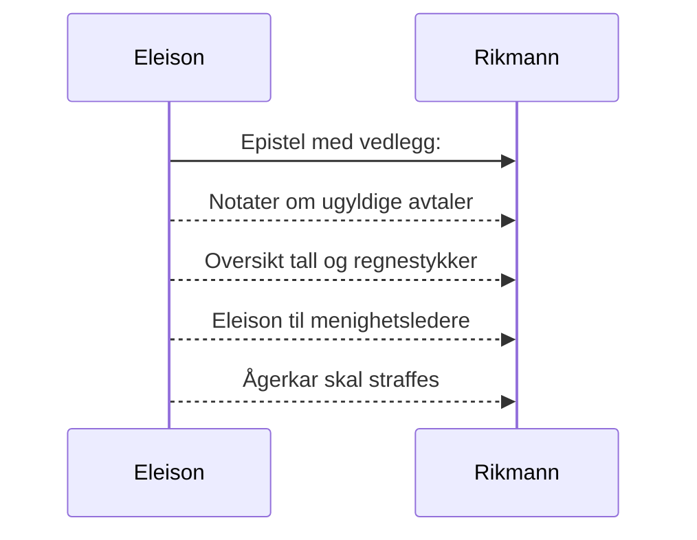

# Eleison til den rike mann
_Dersom du bærer fram et offer til alteret og der kommer til å tenke på at en annen har noe å anklage deg for, så la offergaven ligge foran alteret og gå først og bli forlikt med ham. Kom så og bær fram ditt offer! Skynd deg å komme overens med din motpart mens du ennå er med ham på veien._ [Matt 5, 23-24](https://no.bibelsite.com/matthew/5-23.htm){:target="_blank"}.

Kjære rike mann! _Ingen tjener kan tjene to herrer; for han vil enten hate den ene og elske den andre, eller holde sig til den ene og forakte den andre; I kan ikke tjene Gud og mammon._ (Luk 16, 13) Du er i ferd med å bedra dine søsken og svindle dem for største delen av arven som dere alle burde dele likt. Måten du har gjort det på kan kanskje skjules for de som ikke har forstand på lov og rett. Men Gud være takk som har gitt meg visdom og forstand på lov og rett, og til å skille mellom rett og galt.

Derfor har Gud pålagt Eleison å tvinge deg ved loven for om mulig å føre deg til Kristus. Viser til det grunnleggende prinsipp om at vi ved loven må bli knust og innrømme vår synd før vi kan bli tatt til nåde av Gud.[^1]

## Faktum og drøfting av sak
### Konkret ad et privat lån - som bedrageriet er knyttet til
Da din syke søster ble tvunget til å selge begynte din eldste søster å hjelpe din mor (som vinteren 2022 ble kastet ut av en bolig hun hadde bodd i de siste 20 årene).[^2] Din eldste søster var i ferd med å inngå en avtale med kommunen om at din mor kunne få 100% finanisering.

Faktum er at du da grep inn og ikke lot din mor få låne mer enn ca. 50% av banken. Resten ble hun overtalt til å låne privat hos deg. For å få innvilge dette avdragsfrie private lånet, skrev hun under på et gjeldsbrev som hun sannsynligvis har trodd at hele gjeldsbrevet bestod av et beløp som hun faktisk og reelt hadde mottatt i virkeligheten. 

Dette lånet er notifisert i et gjeldsbrev som etter nærmere øyensyn består av en reel del og en proforma ikke reell del. Begge omtrent like store, hvor den faktiske reelle delen beløper seg til `755 380,-` mens proforma ikke reell del beløper seg til `744 620,-`. Totalt kr. `1 500 000,-`

Vel halvparten av gjeldsbrevet er et beløp som din mor faktisk og reelt trengte (i tillegg til banklånet) for å kjøpe leiligheten og betale til selger (hennes egen datter), nemlig kr. `755 380,-`.

::TipBox{type="announce" name="Uredelig"}
Det er svært urimelig (og uredelig) at du nå ved å gjøre gjeldsbrevet gjeldende krever at du og ditt hus skal innkassere en ikke-reell proforma andel på over `700 000 kroner`.[^3] 

Din mor har sannsynligvis ikke forstått at du ved denne avtalen stjal tre kvart million kroner fra hennes andre barn som hun helt sikkert ikke ville gjort noe slikt mot - hvis hun hadde forstått innholdet i gjeldsbrevet.
::

Enten må du fremlegge dokumenter som beviser at del 2 i gjeldsbrevet som beløper seg til ca. 744 620 kroner er rettmessig, eller frafalle kravet.

### Mot ærbarhet
Det presiseres at det også vil stride mot ærbarhet og gjøre ikke-reell proforma del av gjeldsbrevet gjeldende, og at det i så fall vil dreie seg om urimelig pris for tjenester og varer (som det antas hun har mottatt). Se dok.4.

### Summa
> Inntil det motsatte er bevist hevdes det at vel 94% av gjeldsbrevets del 2 (744 620 x 0.94) er ugyldig (ca. `700 000,-`). Se vedlegg (dok.4) for utregning.

### Prosessen videre
Dersom ikke kravet i del 2 av gjeldsbrevet for det meste frafalles, vil trolig virkningen av det være en prosess hvor rettmessigheten av ditt krav vil prøves av ulike kontrollinstanser. Det er forhåpentligvis dommere som skal prøve gyldigheten av gjeldsbrevet, både innholdsmangler og eventuelle mangler ved din mor (demens).

### Bønn til den rike mann
Det er i kristelig kjærlighet dette skrives til deg. Du får nå mulighet til å omvende deg og avstå fra å fortsette med å la grådigheten styre deg. 

```
Vennlig hilsen

Eleison
Jurist
```

Vedlegg (dok.nr):  

1. (Denne epistel)
2. [Notater om ugyldige avtaler](/article/griskhet/vedlegg-om-ugyldige-avtaler)
3. [Oversikt tall og regnestykker](/article/griskhet/vedlegg-tall-og-regnestykker)
4. [Eleison til menighetsledere](/article/griskhet/eleison-til-menighetsledere)
5. [Ågerkar skal straffes](/article/griskhet/eleison-til-menigheten)



[^1]: Din mor var sannynligvis svekket av demens på slutten og hun har også vært svært fortvilt og hjelpetrengende da hun slet med å finne annen ledig leilighet. (Det er forståelig at du hadde et økonomisk motiv for å kaste henne ut, da kommunen kunne tilby deg 1/2 mer i husleie for flyktninger fra Ukraina.) 
[^2]: Men dersom vi dømte oss selv, blev vi ikke dømt; men når vi dømmes, da refses vi av Herren, forat vi ikke skal fordømmes sammen med verden. [1 Kor 11, 31-32](https://no.bibelsite.com/1_corinthians/11-31.htm){:target="_blank"} Jfr. [Sal 32, 5](https://no.bibelsite.com/psalms/32-5.htm){:target="_blank"} og [Hebr 12, 5-6](https://no.bibelsite.com/hebrews/12-5.htm){:target="_blank"}.
[^3]: Det er sannsynlig at dine nærmeste i ditt hus er medvirkende i bedrageriet som nå forsøkes å realiseres.
[^4]: I dok. 4, oversikt over tall og utregninger, er det antatt at ca. kr. 22 000,- av proforma ikke-reell andel av gjeldsbrevet er betaling for parkett til gulv og maling til vegger.