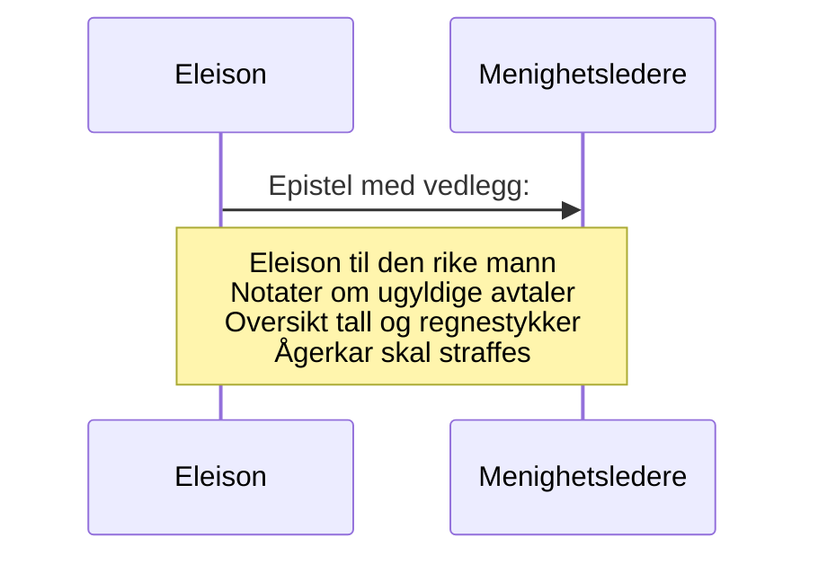

# Eleison til menighetsledere
_Når I da har saker om timelige ting, så setter I dem til dommere som ikke aktes for noget i menigheten! Til skam for eder sier jeg det. Så finnes det da ikke nogen vis mann iblandt eder, ikke en eneste én, som kan skille tretten for sin bror? men bror fører sak mot bror, og det for vantros domstol!_ [1 Kor 6, 4-6](https://no.bibelsite.com/1_corinthians/6-4.htm){:target="_blank"}.

_Slå spotteren, så vil den uforstandige bli klok; vis den forstandige til rette, så vil han komme til innsikt og kunnskap._ [Ords. 19, 25](https://no.bibelsite.com/proverbs/19-25.htm){:target="_blank"}.

_Dem som synder, skal du refse så alle hører på det, forat også de andre må ha frykt._ [1 Tim 5, 20](https://no.bibelsite.com/1_timothy/5-20.htm){:target="_blank"}.

_Så er da loven blitt vår tuktemester til Kristus, forat vi skulde bli rettferdiggjort av tro;_ [Gal 3, 24](https://no.bibelsite.com/galatians/3-24.htm){:target="_blank"}.

## Orientering om saken og drøfting av rettsak mv.
Viser til brevet fra [Eleison til den rike mann](/article/griskhet/eleison-til-den-rike-mann), hvor den rike mann bes om å forsvare seg mot beskyldningene om bedrageri/svindel. Denne beskyldningen nekter han å svare for overfor de fornærmede.

Før det anlegges privat straffesak eller sivil sak for retten bes menighetens øverste om bistand til å innhente et mulig vitnesbyrd fra den mistenkte (som kun vil snakke om hvor mye godt han har gjort og hvor urettferdige andre er i mot han).

Bibelen oppfordrer de kristne til at de **ikke** skal overlate meglingen mellom seg innbyrdes til utenforstående kontrollorganer som er styrt av urettferdige mennesker. 1 Kor 6, 1.[^1]

Oppsummert handler saken om at undertegnede er blitt kjent med at en rik mann i menigheten er anklaget for å forsøke å gjøre seg enda rikere ved urettmessig å _tilrøve_[^2] seg verdier fra en arv som andre fattige søsken, har langt større behov for (og rett til) enn han. Rettslig handler det om bedrageri eller forhold som dekkes av ågerbestemmelsen i den gamle straffeloven, jf. [Ågerkar skal straffes](/article/griskhet/eleison-til-menigheten).

Spørsmålet er om dere som styrer menigheten er interessert i å megle i konflikten eller om dere velsigner eller anbefaler partene å bruke verdslige domstoler (privat straffesak eller sivil sak).

Hvis undertegnede ikke hører noe fra dere, må det regnes som at _den som tier, samtykker_ i at saken skal avgjøres av urettferdige og vantroende.[^3]

I følge `Erik Pontoppidan` kan kristne anlegge sak mot hverandre _"I viktige sakker og ytterste nødsfall må de ta deres tilflukt til dommerembetet, som er Guds orden, og klage deres nød uten hat til motstanderen."_ [Sannhet til gudfryktighet](https://www.nb.no/items/36fe3e5f91f13247e0fb9a3312844909?page=69&searchText=sannhet til gudfryktighet){:target="_blank"}.

## Forsøk på forlik
Den rike mann har vært i kontakt med sine søsken om saken og ikke vært villig til å innrømme at nærmere halve gjeldsbrevet hans er uredelig, eller at han har forsøkt å svike sine søsken til fordel for sitt eget hus. 

Dette fremgår både av muntlige samtaler og en email som Eleison har fått tilgang til (sendt fra den mistenkte 9.mai 23). Derimot babler han meget om hvor edle motiver han har hatt og hvor meget godt han har gjort (som om mistanken om bedrageri/svindel dermed skulle bortfalle).

## To eller tre vitner
Det betyr at anbefalingen etter [Matt 18, 15-17](https://no.bibelsite.com/matthew/18-15.htm){:target="_blank"}[^4] da er å ta saken opp med to eller tre vitner. Det er tre som står oppført som styremedlemmer i den [Luthersk læstadianske forsamling i Tromsø (lyngenretningen)](https://w2.brreg.no/enhet/sok/detalj.jsp?orgnr=994009087){:target="_blank"}

Styrelederne i menigheten oppfordres til å ta kontakt med undertegnede (på epost) for å få telefonnumrene til partene. Kun seriøse henvendelser godtas. All respons offentliggjøres.

```
Vennlig hilsen 

Eleison
Jurist
```

Vedlegg (dok.nr):  

1. [Eleison til den rike mann](/article/griskhet/eleison-til-den-rike-mann)
2. [Notater om ugyldige avtaler](/article/griskhet/vedlegg-om-ugyldige-avtaler)
3. (Denne epistel)
4. [Oversikt tall og regnestykker](/article/griskhet/vedlegg-tall-og-regnestykker)
5. [Ågerkar skal straffes](/article/griskhet/eleison-til-menigheten)



[^1]: _Våger nogen av eder, når han har sak mot sin næste, da å søke dom hos de urettferdige og ikke hos de hellige?_ [1 Kor 6, 1](https://no.bibelsite.com/1_corinthians/6-1.htm){:target="_blank"}.
[^2]: Med _tilrøve_ menes _bedrageri_ fordi forholdet dekkes av gjerningsbeskrivelsen i forbudet mot bedrageri/svindel i straffeloven. Det betyr at den bedragne eller svindlede selv kan anlegge privat straffesak mot den mistenkte for retten. Dette kan gjøres uten å anmelde forholdet til politiet.
[^3]: Undertegnedes erfaring er at de fleste av de som styrer menigheter selv kan regnes som rike, og at det da burde falle mest naturlig for dem å ha mer sympati med sine rike menighetsfeller, enn de fattige og utstøtte. Det er opp til dere å motbevise at dette ikke er tilfellet i denne menigheten.
[^4]: _Men om din bror synder mot dig, da gå bort og irettesett ham i enrum! hører han på dig, da har du vunnet din bror; men vil han ikke høre, da ta ennu en eller to med dig, forat enhver sak skal stå fast ved to eller tre vidners ord. Men hører han ikke på dem, da si det til menigheten! men hører han heller ikke på menigheten, da skal han være for dig som en hedning og en tolder._ [Matt 18, 15-17](https://no.bibelsite.com/matthew/18-15.htm){:target="_blank"}.