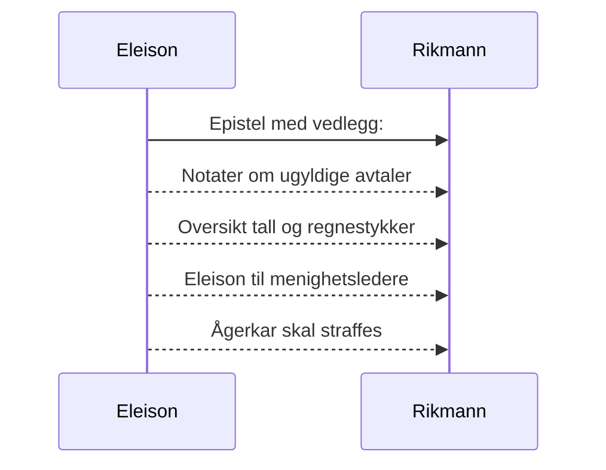

# Eleison til den rike mann
_Dersom du bærer fram et offer til alteret og der kommer til å tenke på at en annen har noe å anklage deg for, så la offergaven ligge foran alteret og gå først og bli forlikt med ham. Kom så og bær fram ditt offer! Skynd deg å komme overens med din motpart mens du ennå er med ham på veien._ [Matt 5, 23-24](https://no.bibelsite.com/matthew/5-23.htm){:target="_blank"}.

## Bibelen om mammon
Bibelen sier at _"de som vil bli rike, faller i fristelse og snare og mange dårlige og skadelige lyster, som senker menneskene ned i undergang og fortapelse. For pengekjærhet er en rot til alt ondt; av lyst dertil har somme faret vill fra troen og har gjennemstunget sig selv med mange piner. Men du, Guds menneske, fly disse ting, jag efter rettferdighet, gudsfrykt, tro, kjærlighet, tålmodighet, saktmodighet!"_ [1 Tim 6, 9-11](https://no.bibelsite.com/1_timothy/6-9.htm){:target="_blank"}

_Ingen tjener kan tjene to herrer; for han vil enten hate den ene og elske den andre, eller holde sig til den ene og forakte den andre; I kan ikke tjene Gud og mammon._ [Luk 16, 13](https://no.bibelsite.com/luke/16-13.htm){:target="_blank"}

## Faktum og drøfting av sak
### Eiendom, lån og gjeldsbrev
Sakens opplysninger fremgår av offentlige opplysninger som er tilgjengelig for enhver, bl.a. på kartverket.no.

Det fremgår at du har lånt 1,5 millioner kroner som bevitnes med et pantsatt gjeldsbrev.

Sannheten er at du har lånt omlag dobbelt så mye som lånetakeren trengte for å kjøpe boligen. Dette fremgår av offentlige opplysninger om pris som selgeren mottok for boligen (som er pantsatt delvis til deg).

### Drøfting av sak
::TipBox{type="announce" name="Hvorfor?"}
Spørsmålet er om det er av hensyn til deg selv du har lånt dobbelt så mye som lånetakeren hadde behov for, eller av barmhjertighet til din neste.[^1] 
::

Det er en kjennsgjerning at lånetakeren tidligere har vært leietaker i flere av dine eiendommer, og at du har benyttet en kontrakt som er til fordel for Huseierne og ikke til fordel for Forbrukerne.

Det er velkjent at slike forretningskontrakter gir Hushaiene anledning til å kreve at leietakeren dekker vedlikehold av leiligheten, i tillegg til den ordinære husleien. Denne innkrevingen skjer i praksis ved utflytting.

### Urimelig pris
Det går nå rykter om at du og din tildels urettferdige familie har pusset opp flere av dine boliger, og at du har tatt betaling tilsvarende det profesjonelle bygnings-entreprenører tar for jobben, etter at den du lånte penger til, flyttet inn i den kjøpte boligen (med mange hundre tusen kroner mer i gjeld enn nødvendig).

Det strider `mot ærbarhet` at en ufaglært krever tilsvarende pris for en tjeneste, som åpenbart ikke har topp kvalitet. Saken synes dermed å dreie seg om urimelig pris for tjenester og varer. [Se dok 4](/article/epistler/a/vedlegg-tall-og-regnestykker).

### Summa
> Det er kjent at du tilsammen har mottatt et sekssifret beløp i husleie av leietakeren, som nå står i gjeld til deg. Bare dette enkkle forholdet har medført at du er blitt rikere, mens leietakeren er blitt fattgere. I tillegg synes det som du har mottatt flere hundre tusen kroner fra leietakeren, etter at denne flyttet inn i sin egen pantsatte bolig. [ Se vedlegg (dok 4)](/article/epistler/a/vedlegg-tall-og-regnestykker) for utregning av regnestykker.

Det forhold at du som huseier har erfart at det er vanskelig å kreve inn ekstrabetaling fra leietakerne etter at de flytter ut, for vedlikehold av boligen, har medført at du har misbrukt din posisjon til å yte et privat lån i forbindelse med leietakerens anskaffelse av egen bolig.

På denne måten har du sikret deg selv at du kan ta så mye betaling som du begjærer, for vedlikehold. (Og hvem kan kontrollere og stille deg til ansvar om det også eventuelt handler om oppussing? Antakelig bare Gud på dommens dag.)

### Bønn til den rike mann
Det er i kristelig omtanke dette skrives til deg. Du har nå mulighet til å forklare deg og gjøre opp for deg her i livet, for eventuelt uhederlige tvilsomme forretninger.

> Gud bevare deg fra at du først på dommens dag blir stilt til ansvar.

Selv om du har god samvittighet betyr ikke det nødvendigvis at andre ikke har høyere normer og stiller spørsmålstegn ved deg.

På dommens dag hjelper deg ikke hva du selv synes, da er det den fattige kristne som skal dømme deg.

> **Vet dere ikke at de hellige skal dømme verden?** [1 Kor 6, 2](https://no.bibelsite.com/1_corinthians/6-2.htm){:target="_blank"}

::TabGroup
::::TabItem{name="-"}
::::

::::TabItem{name="Mvh"}
Med vennlig hilsen 

Eleison  
Jurist
::::

::::TabItem{name="Vedlegg"} 
1. (Denne epistel)
2. [Notater om ugyldige avtaler](/article/epistler/a/vedlegg-om-ugyldige-avtaler)
3. [Eleison til menighetsledere](/article/epistler/a/eleison-til-menighetsledere)
4. [Oversikt tall og regnestykker](/article/epistler/a/vedlegg-tall-og-regnestykker)
5. [Ågerkar skal straffes](/article/epistler/a/aagerkar-skal-straffes)
::::

::

[^1]: Det er sannsynlig at dine nærmeste i ditt hus er medvirkende i bedrageriet som nå forsøkes realisert.
