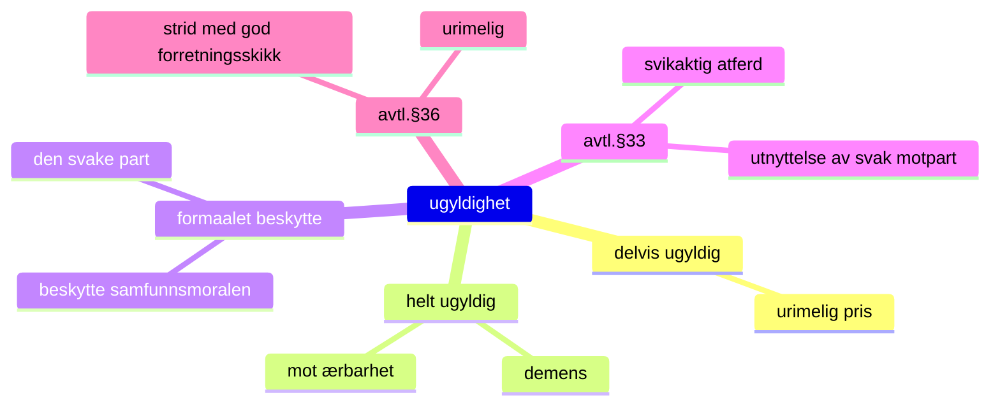

# Vedlegg: Notater om ugyldige avtaler
Selv om bindende avtale er inngått kan den senere kjennes ugyldig pga. _mangler_ ved _partene_ eller _innholdet_. Viser til avtaleloven, ulovfestet rett, rettspraksis og juridisk litteratur over dette svært poplulære faget. Nedfor oppgis kun noen stikkord for å identifisere det viktigste og antyde omfanget av emnet.

## Helt eller delvis ugyldig
En avtale kan kjennes delvis ugyldig ved
- urimelig pris.

### En avtale kan kjennes helt ugyldig ved
- umyndighet (sinnsykdom/demens ulovfestet)[^1]
- mot ærbarhet (NL 5-1-2)

### Formålet med ugyldighetsreglene er å
- beskytte den svake part
- beskytte samfunnsmoralen.

### Uredelighet (avtl. $ 33)
Hva retten har slått fast er uredelig:
- Svikaktig atferd, jf. Rt. 2008 s. 1365
- Utnyttelse av ruspåvirket og svak motpart, jf. Pushwagnerdommen.
- Misforhold mellom ytelse og motytelse, jf. Rt. 2014 s. 351.

Urimelig eller i strid med god forretningsskikk (avtl. $ 36)

::TipBox{type="tip"}
Gjeldsbrevlova slår fast at avtalerettens regler om ugyldighet også gjelder gjeldsbrev.
::

[Kilde for ovenstående notater](https://rettslaere.portfolio.no/read/8476d9bc-ee3c-48ee-95ea-2341ecc4d43d){:target="_blank"}

Vedlegg (dok.nr):  

* 5. [Ågerkar skal straffes](/article/epistler/a/eleison-til-menigheten)

[^1]: Eldre inngår ofte avtaler om arv og lignende som omstøtes pga. demens.