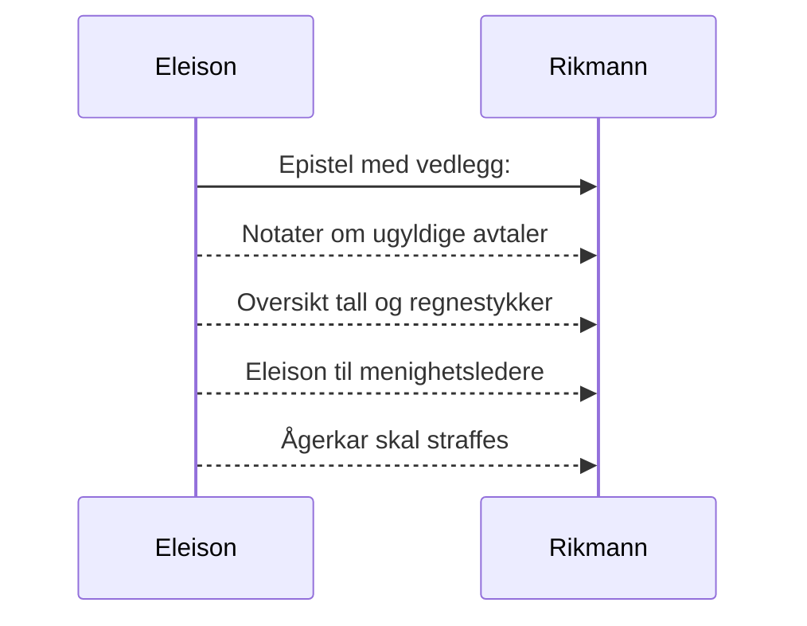

# Eleison til den rike mann
_Dersom du bærer fram et offer til alteret og der kommer til å tenke på at en annen har noe å anklage deg for, så la offergaven ligge foran alteret og gå først og bli forlikt med ham. Kom så og bær fram ditt offer! Skynd deg å komme overens med din motpart mens du ennå er med ham på veien._ [Matt 5, 23-24](https://no.bibelsite.com/matthew/5-23.htm){:target="_blank"}.

## Bibelen om mammon
Bibelen sier at _"de som vil bli rike, faller i fristelse og snare og mange dårlige og skadelige lyster, som senker menneskene ned i undergang og fortapelse. For pengekjærhet er en rot til alt ondt; av lyst dertil har somme faret vill fra troen og har gjennemstunget sig selv med mange piner. Men du, Guds menneske, fly disse ting, jag efter rettferdighet, gudsfrykt, tro, kjærlighet, tålmodighet, saktmodighet!"_ [1 Tim 6, 9-11](https://no.bibelsite.com/1_timothy/6-9.htm){:target="_blank"}

_Ingen tjener kan tjene to herrer; for han vil enten hate den ene og elske den andre, eller holde sig til den ene og forakte den andre; I kan ikke tjene Gud og mammon._ [Luk 16, 13](https://no.bibelsite.com/luke/16-13.htm){:target="_blank"}

## Hvorfor refse?
> _Du skal ikke hate din bror i ditt hjerte, men du skal irettesette din næste, forat du ikke skal få synd på dig for hans skyld._ [3 Mos 18, 17](https://no.bibelsite.com/leviticus/19-17.htm){:target="_blank"}.[^1]

> _Den som sparer sitt ris, hater sin sønn; men den som elsker ham, tukter ham tidlig._ [Ordsp. 13, 24](https://no.bibelsite.com/proverbs/13-24.htm){:target="_blank"}

> _Ja, salig er det menneske Gud refser, og den Allmektiges tukt må du ikke akte ringe!_ [Job 5, 17](https://no.bibelsite.com/job/5-17.htm){:target="_blank"}

> _For budet er en lykte og læren et lys, og tilrettevisninger til tukt er en vei til livet, så de bevarer dig fra en ond kvinne, fra en fremmed kvinnes glatte tunge._ [Orsp. 6, 23-24](https://no.bibelsite.com/proverbs/6-23.htm){:target="_blank"}

## Faktum og drøfting av sak
### Konkret ad et privat lån - som bedrageriet er knyttet til
Historien begynner med en bolig som din syke søster ble tvunget til å selge. En av hennes søsken begynte å hjelpe hennes mor med å kjøpe denne boligen.

Faktum er at hun hadde fått tilbud om 100% finansiering, da du grep inn og overtalte henne til å låne halvparten av kjøpesummen privat hos deg. For å få innvilget dette avdragsfrie private lånet, skrev hun under på et gjeldsbrev, som hun naturligvis har trodd bestod av et beløp som hun faktisk og reelt ville motta i virkeligheten. 

Dette lånet synes ved nærmere granskning å bestå av en reell del og en proforma ikke reell del. Begge omtrent like store, hvor den faktiske reelle delen beløper seg til `755 380,-` mens proforma ikke reell del beløper seg til `744 620,-`. Totalt lyder gjeldsbrevet på kr. `1 500 000,-`

Vel halvparten av gjeldsbrevet `755 380,-` er et beløp som din mor faktisk og reelt trengte (i tillegg til banklånet) for å kjøpe leiligheten fra hennes syke datter.

### Drøfting av sak
::TipBox{type="announce" name="Uredelig"}
Det oppleves som uredelig at du nå gjør gjeldsbrevet gjeldende og krever at du og ditt hus skal motta en ikke-reell proforma andel på over `700 000 kroner`.[^2] 

Din mor har sannsynligvis ikke forstått at du ved denne avtalen forsøker å forfordele tre kvart million kroner fra hennes andre barn, som hun selvfølgelig ikke ville gjort hvis hun hadde forstått innholdet i gjeldsbrevet. Viser til at hun var svært hjelpetrengende og ute av stand til å ta vare på seg selv. De fleste som hadde kontakt med henne har sagt at hun ble svært dement og syk det siste året hun levde.
::

Enten må du fremlegge dokumenter som beviser at del 2 i gjeldsbrevet som beløper seg til ca. 744 620 kroner er rettmessig, eller frafalle kravet.

### Mot ærbarhet
Det presiseres at det også vil stride `mot ærbarhet` og gjøre ikke-reell proforma del av gjeldsbrevet gjeldende, og at det i så fall vil dreie seg om urimelig pris for tjenester og varer (som det antas hun har mottatt). [Se dok 4](/article/epistler/griskhet/_vedlegg-tall-og-regnestykker).

### Summa
> Inntil det motsatte er bevist hevdes det at vel 94% av gjeldsbrevets del 2 (744 620 x 0.94) er ugyldig (ca. `700 000,-`). [ Se vedlegg (dok 4)](/article/epistler/griskhet/_vedlegg-tall-og-regnestykker) for utregning av regnestykker.[^3]

### Bønn til den rike mann
Det er i kristelig omtanke dette skrives til deg. Du har nå mulighet til å forklare deg og eventuelt avvise mistankene som du ser at andre har til deg.

```
Vennlig hilsen

Eleison
Jurist
```

Vedlegg (dok.nr):  

1. (Denne epistel)
2. [Notater om ugyldige avtaler](/article/epistler/griskhet/vedlegg-om-ugyldige-avtaler)
3. [Eleison til menighetsledere](/article/epistler/griskhet/eleison-til-menighetsledere)
4. [Oversikt tall og regnestykker](/article/epistler/griskhet/_vedlegg-tall-og-regnestykker)
5. [Ågerkar skal straffes](/article/epistler/griskhet/eleison-til-menigheten)



[^1]: _For jeg vil gi dere ord og visdom som ingen av deres motstandere skal kunne motstå eller motsi._ [Luk 21, 15](https://no.bibelsite.com/luke/21-15.htm){:target="_blank"} og _Å frykte Herren er opphav til visdom, alle som gjør det, har god forstand._ [Sal 111, 10](https://no.bibelsite.com/psalms/111-10.htm){:target="_blank"}. _Men dersom vi dømte oss selv, blev vi ikke dømt; men når vi dømmes, da refses vi av Herren, forat vi ikke skal fordømmes sammen med verden._ [1 Kor 11, 31-32](https://no.bibelsite.com/1_corinthians/11-31.htm){:target="_blank"} Jfr. [Sal 32, 5](https://no.bibelsite.com/psalms/32-5.htm){:target="_blank"} og [Hebr 12, 5-6](https://no.bibelsite.com/hebrews/12-5.htm){:target="_blank"}.
[^2]: Det er sannsynlig at dine nærmeste i ditt hus er medvirkende i bedrageriet som nå forsøkes realisert.
[^3]: [I dok 4](/article/epistler/griskhet/_vedlegg-tall-og-regnestykker), _Oversikt tall og utregninger_, er det antatt at ca. kr. 22 000,- av proforma ikke-reell andel av gjeldsbrevet, er betaling for parkett til gulv og maling til vegger.