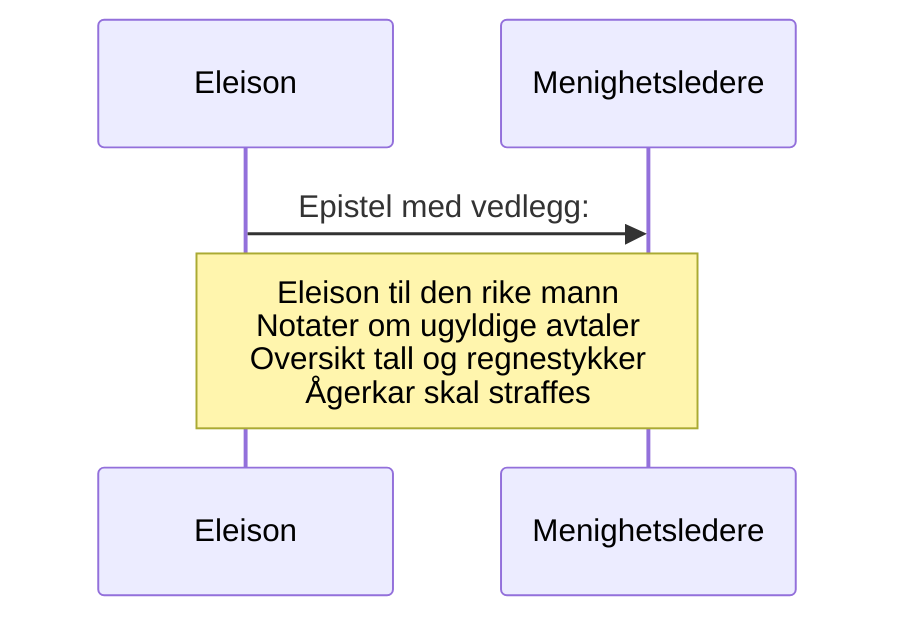

# Eleison til menighetsledere
_Når I da har saker om timelige ting, så setter I dem til dommere som ikke aktes for noget i menigheten! Til skam for eder sier jeg det. Så finnes det da ikke nogen vis mann iblandt eder, ikke en eneste én, som kan skille tretten for sin bror? men bror fører sak mot bror, og det for vantros domstol!_ [1 Kor 6, 4-6](https://no.bibelsite.com/1_corinthians/6-4.htm){:target="_blank"}.

_Slå spotteren, så vil den uforstandige bli klok; vis den forstandige til rette, så vil han komme til innsikt og kunnskap._ [Ords. 19, 25](https://no.bibelsite.com/proverbs/19-25.htm){:target="_blank"}.

_Dem som synder, skal du refse så alle hører på det, forat også de andre må ha frykt._ [1 Tim 5, 20](https://no.bibelsite.com/1_timothy/5-20.htm){:target="_blank"}.

_Så er da loven blitt vår tuktemester til Kristus, forat vi skulde bli rettferdiggjort av tro;_ [Gal 3, 24](https://no.bibelsite.com/galatians/3-24.htm){:target="_blank"}.

## Orientering om saken og drøfting av rettsak mv.
Eleison, Jesu Kristi tjener, hilser menighetens eldste fra Gud vår far og Jesus Kristus vår Herre! 

Som dere vet, har verdslige menneskers levemåte påvirket de kristne slik at de ikke skammer seg ved å jage etter rikdom og mammon, selv om bibelen taler mot dette.[`1]

Det går nå rykter om en rik mann i menigheten som forsøker å bedra andre kristne brødre og søstre. Undertegnede har blitt ledet til å ta kontakt med vedkommende, viser til brevet fra [Eleison til den rike mann](/article/epistler/griskhet/eleison-til-den-rike-mann), hvor han blir bedt om å forklare seg.

::TipBox{type="achieve" name="Forenklet saksfremstilling"}
For å forenkle saken for ikke-jurister kan man si at det handler om kontrakter hvor den rike mannen med ukristelige lover tar fra fattige for å berike seg selv.
::

Bibelen oppfordrer kristne til at de **ikke** skal overlate meglingen mellom seg innbyrdes til utenforstående kontrollorganer som er styrt av urettferdige mennesker. [1 Kor 6, 1](https://no.bibelsite.com/1_corinthians/6-1.htm){:target="_blank"}.[^2]

Før det anlegges sivil sak for retten bes menighetens øverste om bistand til å innhente et mulig vitnesbyrd fra den mistenkte (rike mannen)

Spørsmålet er om dere som styrer menigheten er interessert i å megle i konflikten eller om dere velsigner eller anbefaler partene å bruke verdslige domstoler.

I følge `Erik Pontoppidan` kan kristne anlegge sak mot hverandre _"I viktige sakker og ytterste nødsfall må de ta deres tilflukt til dommerembetet, som er Guds orden, og klage deres nød uten hat til motstanderen."_ [Sannhet til gudfryktighet](https://www.nb.no/items/36fe3e5f91f13247e0fb9a3312844909?page=69&searchText=sannhet til gudfryktighet){:target="_blank"}.

## Forsøk på forlik
Den rike mann har vært i kontakt med sine søsken om saken og selv styrket mistanken om at han har noe å skjule, da han kun har snakket om hvor mye godt han har gjort, istedenfor å gjøre rede for saken. 

Dette fremgår både av muntlige samtaler og en email som Eleison har fått tilgang til (sendt fra den mistenkte 9.mai 23).

## To eller tre vitner
Hvis undertegnede har forstått bibelen rett er budskapet fra [Matt 18, 15-17](https://no.bibelsite.com/matthew/18-15.htm){:target="_blank"}[^3] og ta saken opp med to eller tre vitner. Det er tre som står oppført som styremedlemmer i den [Luthersk læstadianske forsamling i Tromsø (lyngenretningen)](https://w2.brreg.no/enhet/sok/detalj.jsp?orgnr=994009087){:target="_blank"}

Styrelederne i menigheten oppfordres herved til å ta kontakt.

## Avsluttende konklusjon
Eleisons vurdering er at når menighetens ledere ikke tidligere har engasjert seg i indre konflikter, er det lite sannsynlig at de våger det nå. Formelt har i alle fall menighetens øverste fått muligheten til å megle, slik at ingen i ettertid kan nekte for at predikantene indirekte har rådet å benytte verdslige kontrollorganer.

```
Vennlig hilsen 

Eleison
Jurist
```

Vedlegg (dok.nr):  

1. [Eleison til den rike mann](/article/epistler/griskhet/eleison-til-den-rike-mann)
2. [Notater om ugyldige avtaler](/article/epistler/griskhet/vedlegg-om-ugyldige-avtaler)
3. (Denne epistel)
4. [Oversikt tall og regnestykker](/article/epistler/griskhet/vedlegg-tall-og-regnestykker)
5. [Ågerkar skal straffes](/article/epistler/griskhet/eleison-til-menigheten)



[^1]: _men de som vil bli rike, faller i fristelse og snare og mange dårlige og skadelige lyster, som senker menneskene ned i undergang og fortapelse. 10 For pengekjærhet er en rot til alt ondt; av lyst dertil har somme faret vill fra troen og har gjennemstunget sig selv med mange piner. 11 Men du, Guds menneske, fly disse ting, jag efter rettferdighet, gudsfrykt, tro, kjærlighet, tålmodighet, saktmodighet!_ [1 Tim 6, 9-11](https://no.bibelsite.com/1_timothy/6-9.htm){:target="_blank"}
[^2]: _Våger nogen av eder, når han har sak mot sin næste, da å søke dom hos de urettferdige og ikke hos de hellige?_ [1 Kor 6, 1](https://no.bibelsite.com/1_corinthians/6-1.htm){:target="_blank"}.
[^3]: _Men om din bror synder mot dig, da gå bort og irettesett ham i enrum! hører han på dig, da har du vunnet din bror; men vil han ikke høre, da ta ennu en eller to med dig, forat enhver sak skal stå fast ved to eller tre vidners ord. Men hører han ikke på dem, da si det til menigheten! men hører han heller ikke på menigheten, da skal han være for dig som en hedning og en tolder._ [Matt 18, 15-17](https://no.bibelsite.com/matthew/18-15.htm){:target="_blank"}.